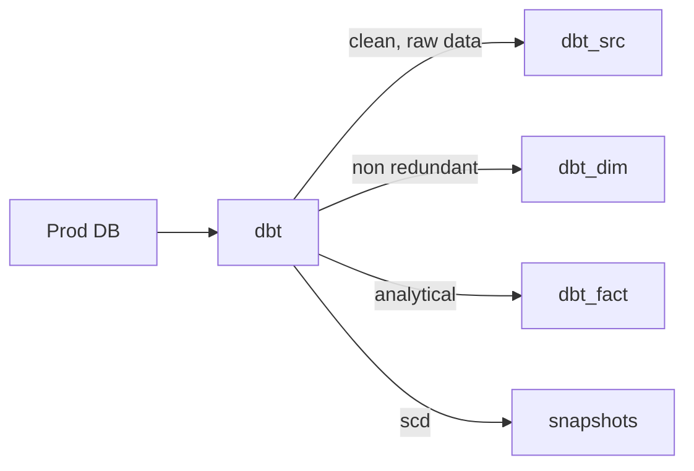
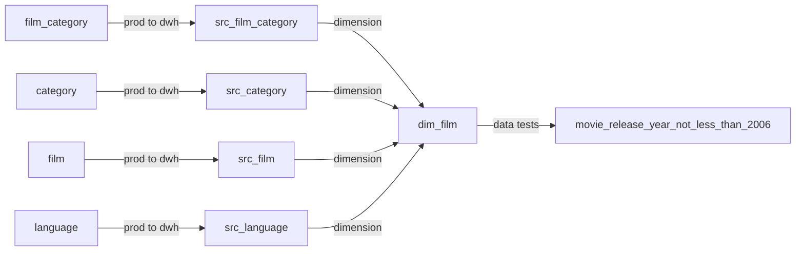

# Welcome to Dashing DataWarehouse with dbt project!

# index
- [Data Architecture](#data_architecture)
- [DAG Sample](#dag_sample)
- [Directory Structure](#dir-structure)
- [Prerequisites](#prerequisites)
- [How to Run This Project](#how_to_run_this_project)
- [Lessons learned](#lessons_learned)

# data_architecture


# dag_sample


# dir-structure

```
project
│   README.md
│   requirements.txt  
|   .gitignore  
|   packages.yml
|   dbt_project.yml
│
└───miscellaneous
│   │   dvdrental.tar     : example DB for postgres
│   
└───models
│   │   schema.yml       : for generic test & documentation
|   └───source.yml       : Data sources
│   └───src              : all core sql file
│   └───dim              : data generated from src
│   └───fact             : data generated from src
│
└───seeds
│   │   *.csv     : static file want to export in DWH
│   
└───snapshots
│   │   *.sql     : history/log of tables
│   
└───tests
│   │   *.sql     : custom singular test file 
│
└───macros
│   │   test_*.sql     : generic(parameterized) test file 
```

# prerequisites
- Python
- SQL
- PostgreSQL
- dbt
- Linux/mac

# how_to_run_this_project
+ create python venv
    ```sh
    python3 -m venv venv_name
    ```
+ activate: 
    ```sh 
    source venv_name/bin/activate 
    ```
+ install dependency
    ```sh
    pip install -r requirements.txt
    ```

+ DB setup(`postgres` )
    + **DBName**: dvdrental
    + restore the DB: ```miscellaneous --> dvdrental.tar``` in ```public``` schema

+ clone the repo
+ clone and rename the `profiles_sample.yml` to `profiles.yml`
+ Update the credentials in `profiles.yml`
+ check config: ```dbt debug --target dev```
+ install dbt packages: ```dbt deps --target dev```
+ test project: ```dbt test --target dev```
+ run project: ```dbt run --target dev```
+ snapshot/log generate: ```dbt snapshot --target dev```
+ Documentation of project:
    ```sh
    dbt docs generate --target dev
    ```
    ```sh
    dbt docs serve --port 8002 --target dev
    ```

# lessons_learned
- materialization
    - table
    - view
    - incremental
    - ephemeral (`not implemented`)
- macros
- test
    - generic
    - singular
- snapshot
    - SCD2
- dbt docs
- configurations
    - `dbt_project.yml`
    - `source.yml`
    - `schema.yml`